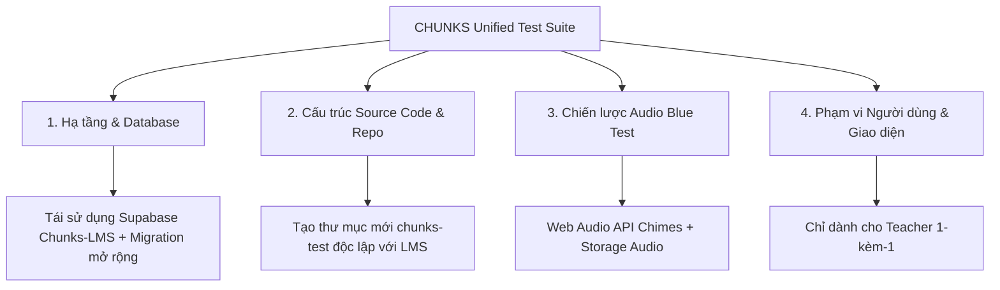

# Grill Decision Record (GDR-001)

**Status:** Decided & Applied  
**Date:** 2026-09-17  
**Facilitator:** Matt Advisor / Grilling Protocol  

---

## 1. Bối cảnh Khảo sát (The Problem Space)
Hệ thống hiện tại phân tán làm 2 codebase:
- `Chunks-LMS`: Chứa backend Supabase hoàn chỉnh, nghiệp vụ trường học (lớp, lịch, điểm danh) cùng hai bài test độc lập: Red Test (56V) và Green Test (49Q).
- `chunks-blue`: Ứng dụng độc lập chạy local storage và Node.js Express, hỗ trợ Blue Test (49 thử thách, Conscious Time $L_n = 1.86^n$, Cumulative Component Exposure $k=1..49$).

Yêu cầu: Kết hợp cả 3 bài test vào một ứng dụng độc lập, giải quyết bài toán cơ sở dữ liệu và bóc tách các hàm nghiệp vụ cốt lõi.

---

## 2. Kết quả Grilling Interview (Settled Frontier Decisions)

### ❓ Q1: Cấu trúc Dự án Mới (New App vs Stripped Clone)
- **Đã chọn:** **Phương án A — Greenfield Unified App (`chunks-test`)**.
- **Lý do:** Khởi tạo project mới tinh gọn (Vite + React 19 + TypeScript + Tailwind CSS v4 + Supabase client) loại bỏ 100% rác và nợ kỹ thuật từ module quản lý lớp học của LMS cũ.

### ❓ Q2: Chiến lược Quản lý Audio cho Blue Test
- **Đã chọn:** **Phương án A — Pre-generated Storage Audio & Web Audio Synthesizer**.
- **Lý do:** Red và Green test dùng audio nạp sẵn trên Supabase Storage. Đối với Blue Test, các âm thanh chuông báo và tín hiệu cue được tổng hợp trực tiếp bằng Web Audio API (0ms latency, không phụ thuộc API key Gemini lúc thi) và audio intro đồng bộ lên Storage bucket `audio-assets`.

### ❓ Q3: Kiến trúc Cơ sở dữ liệu: Tạo DB mới hay Tái sử dụng Supabase?
- **Đã chọn:** **Phương án A — Tái sử dụng 100% Supabase instance của Chunks-LMS (`ekubetkxfcuxlyahesrl`) + Bảng vệ tinh**.
- **Lý do:**
  1. Tránh phân mảnh danh tính học viên (Learner Identity).
  2. Tái sử dụng hạ tầng xác thực (Supabase Auth / RLS) và Audio Storage bucket hiện có.
  3. Kế thừa các bảng `standalone_test_assignments`, `standalone_test_runs`, `standalone_test_attempts`, `standalone_test_events`.
  4. Mở rộng thêm 2 bảng vệ tinh: `blue_test_attempt_metrics` và `blue_test_component_events` phục vụ các thông số riêng biệt của Blue Test.

### ❓ Q4: Actor Model & Luồng người dùng (User Flow)
- **Đã chọn:** **Phương án A — Teacher-led 1-on-1**.
- **Lý do:** Cả 3 bài test (đặc biệt là Blue Test với 7 đạo cụ tương tác thực tế giữa Captain và Crew) bắt buộc giáo viên/examiner trực tiếp điều khiển phòng thi và chấm điểm.

---

## 3. Cây Quyết định Thiết kế (Design Tree)

